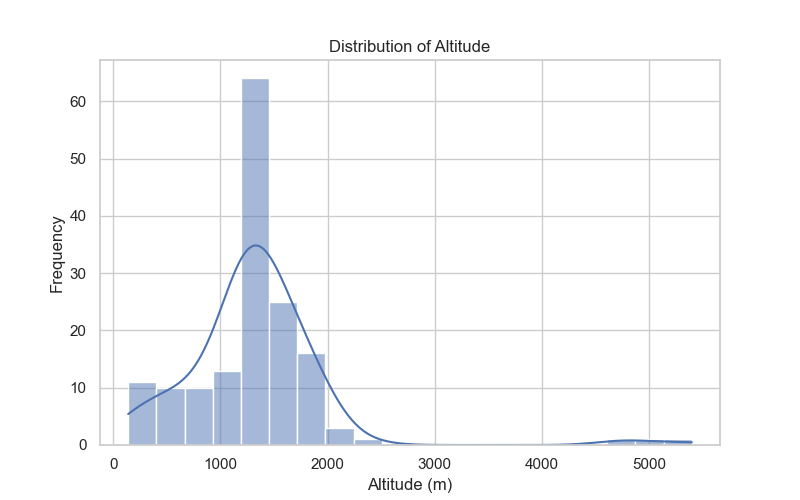
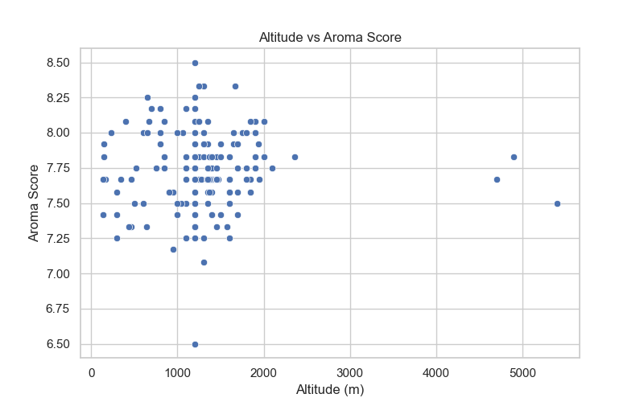
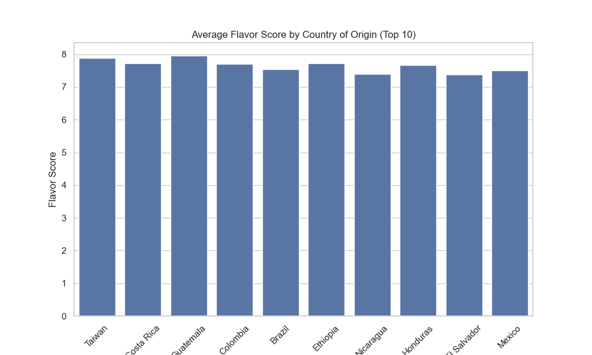

# Coffee Quality Analysis
Analyzing coffee bean data to uncover key quality factors.

## Dataset
The dataset contains information about coffee beans, including country of origin, altitude, variety, harvest year, and quality scores such as aroma and flavor.  

- **Source:** [Coffee Quality Data (Kaggle)](https://www.kaggle.com/datasets/fatihb/coffee-quality-data-cqi)  
- **Local file:** `coffee_quality/Data/df_arabica_clean.csv`

## Exploratory Data Analysis (EDA) 
### 1. Altitude Distribution  
### 2. Relationship between Altitude and Aroma  
### 3. Average Flavor Score by Country of Origin (Top 10) 

## Insights
- Most coffee is grown at mid-altitudes, which might affect flavor profiles.
- Higher altitudes tend to have better aroma scores, suggesting a positive correlation.
- Flavor scores vary across countries, with the top 10 producing the highest quality beans.

## Tools and Libraries 
- Python 
- Pandas, NumPy, Polars 
- Matplotlib, Seaborn